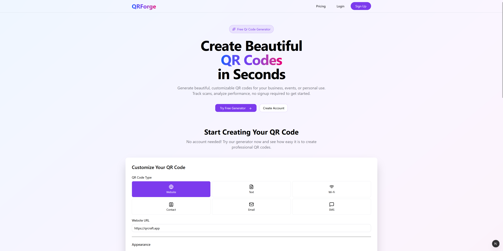
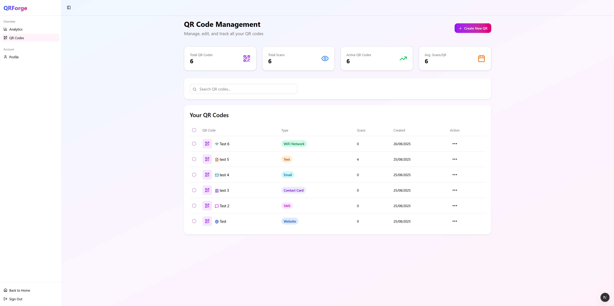
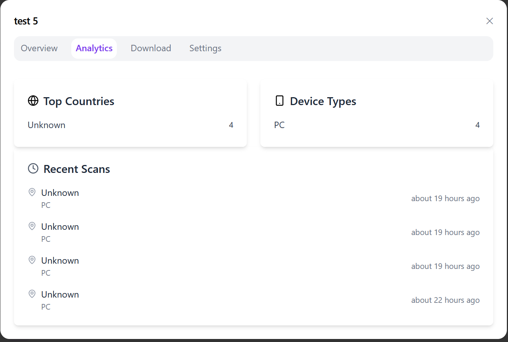

# QR Code Manager

> Next.js frontend for creating and managing dynamic QR codes with analytics



## Features

- Create dynamic QR codes for websites, text, WiFi, contacts, email, and SMS
- Real-time analytics with scan tracking and device statistics
- Custom QR code styling (colors, size, borders)
- Multi-format export (PNG, JPEG, SVG, PDF)
- User authentication and profile management
- Responsive design for all devices
- Dashboard with QR code management

## Quick Start

```bash
# Install dependencies
npm install

# Run development server
npm run dev

# Open http://localhost:3000
```

## Tech Stack

- **Next.js 15** (App Router)
- **React 19**
- **TypeScript**
- **Tailwind CSS v4**
- **React Hot Toast** for notifications

## Environment Setup

Copy the environment file and configure your API URL:

```bash
cp .env.example .env.local
```

Required environment variables:
```env
NEXT_PUBLIC_API_URL=http://127.0.0.1:8000
NEXT_PUBLIC_APP_ENV=development
```

## Project Structure

```
src/
├── app/                    # Next.js App Router
│   ├── contexts/          # React contexts (auth, theme, etc.)
│   ├── dashboard/         # Protected dashboard pages
│   ├── login/            # Authentication pages
│   └── signup/           
├── components/            # Reusable UI components
├── hooks/                # Custom React hooks
└── libs/
    ├── constants/        # Application constants
    ├── services/         # API service layer
    └── types/            # TypeScript type definitions
```

## Available Scripts

```bash
npm run dev        # Start development server
npm run build      # Build for production
npm run start      # Start production server
npm run lint       # Run ESLint
npm run type-check # TypeScript type checking
```

## Key Components

### Authentication
- User registration and login
- Client-side authentication state management
- Simple localStorage-based session management

### QR Code Management
- Interactive QR code builder
- Live preview with customization options
- Individual QR code CRUD operations

### Analytics Dashboard
- Scan statistics
- Geographic distribution
- Device and browser analytics

## API Integration

This frontend consumes the QR Code API. Make sure the backend is running before starting development.

**Related Projects:**
- **Backend API**: [QR Code API](https://github.com/SynysterRev/qr-gen-back)

## Development Notes

- Built with Next.js App Router for modern React patterns
- Uses TypeScript for type safety
- Design with Tailwind CSS
- Hot reloading enabled for development
- Toast notifications for user feedback

## Screenshots

### Dashboard


### QR Code Creator


### Analytics

